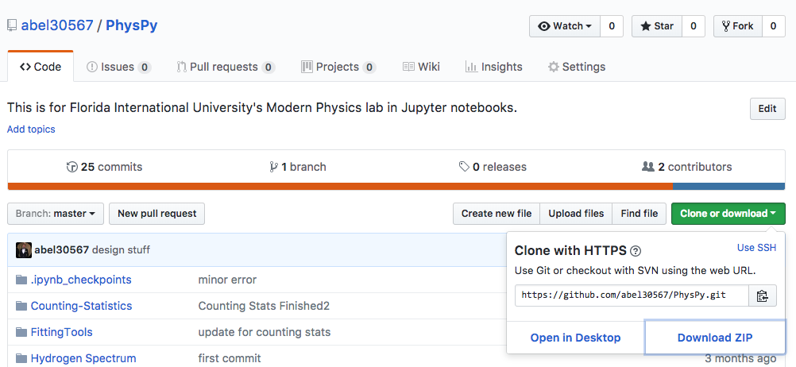

# PhysPy
## An interactive tutorial for Intermediate Physics Lab

#### Created by Claudio Atilano & Justin Cata

January 11, 2018

<iframe src="https://giphy.com/embed/3ohjVcveOM9hoSVTAk" width="480" height="300" frameBorder="0" class="giphy-embed" allowFullScreen></iframe>
<a href="https://giphy.com/gifs/3ohjVcveOM9hoSVTAk">via GIPHY</a>

Hi everyone, if you are seeing this you must be in Florida International University's Intermediate Physics Lab! 

This course is very difficult and challenging. We felt like there was a huge learning curve in lab specially with the python coding that we were never introduced to! 

We are both FIU Physics Bachelors and we messed around with this technology after we graduated. We thought "Wow this would be great to have during lab." After several discussions, we just decided to go on and do it! 

Our original plan was to create an entire curriculum of lab here using Jupyter notebooks. Unfortunately, the FIU department saw this not as challenging and brushed us off. Well, since we got this far why not post it right? We created these tutorials from the labs that we did using Dr. Werner Boeglin's content.

In order to have this tutorial we have to install a couple of things.

## Installation

1. You will need to install Anaconda-Navigator,

Install is <a href="https://www.anaconda.com/download/">HERE</a>

2. Once Anaconda is installed you will need to download the zip file that is on this page. It looks like the image below.
 

3. Once you unzip the zip file you should have a folder called <strong>PhysPy-master</strong> drag it to your Desktop.

4. Lets open Anaconda-Navigator, you should see something like this:
 

 
5. Now lets open <strong>Jupyter Notebook</strong>, you should see something like this:
 

 
6. Go to your Desktop and open the <strong>PhysPy-master</strong> folder. Start the tutorials! We suggest starting at the E-M Ratio then onto Counting Stats!

## Notebook Instructions

To execute cells you need to hold Shift + Enter

Try Googling stuff related to errors. If there is an installation error the errors should tell you how to fix it!

Best of luck and happy coding!